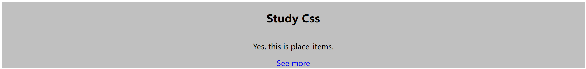
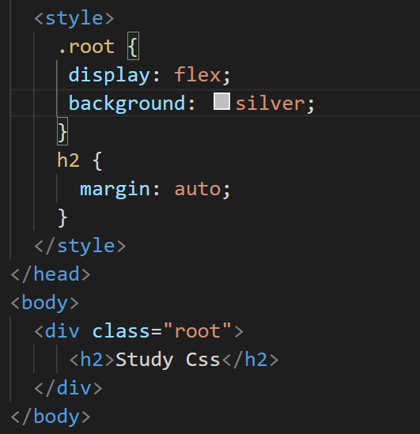

# 1 place-items

简单实现内部元素水平垂直居中。




`place-items`是将 `justify-items`和 `align-items`结合在一起的简写属性。

使用的时候需要看下兼容性。

# 2 flex和margin结合使用

与flexbox 结合使用，`margin: auto` 可以非常轻松地将 flex 项目水平和垂直居中。



# 3 列表的marker属性

可以用来给li元素前面的小圆点增加样式。


# 4 column-rule 属性

可以设置文章的列宽，几列，列与列之间的间距，分割线的样式：


columns: *column-width column-count* ;

[Column-count](https://www.runoob.com/try/try.php?filename=trycss3_column-count)
div元素的文本分成三列。

[Column-gap](https://www.runoob.com/try/try.php?filename=trycss3_column-gap)
在div元素的文本分成三列，并指定一个30像素的列之间的差距。

[Column-rule](https://www.runoob.com/try/try.php?filename=trycss3_column-rule)
指定列之间的规则：宽度，样式和颜色。

column-width

指定列宽度

# 5 `object-fit:contain`


加上object-fit:contain之前：


加上以后


很明显的效果，适合放置logo的需求：


object-fit属性值：

* `fill`: 中文释义“填充”。默认值。替换内容拉伸填满整个content box, 不保证保持原有的比例。
* `contain`: 中文释义“包含”。保持原有尺寸比例。保证替换内容尺寸一定可以在容器里面放得下。因此，此参数可能会在容器内留下空白。
* `cover`: 中文释义“覆盖”。保持原有尺寸比例。保证替换内容尺寸一定大于容器尺寸，宽度和高度至少有一个和容器一致。因此，此参数可能会让替换内容（如图片）部分区域不可见。
* `none`: 中文释义“无”。保持原有尺寸比例。同时保持替换内容原始尺寸大小。
* `scale-down`: 中文释义“降低”。就好像依次设置了none或contain, 最终呈现的是尺寸比较小的那个。

内容拉伸(fill)，内容全部都显示(contain)，容器没有留白(cover)，该多大就多大(none)。

解决IE的兼容性问题：

```
	import objectFitImages from "object-fit-images"; // 引入 objectFitImages 方法

	// 可以处理多张图片（方法一）
    const images = document.querySelectorAll("img.your-image");
    objectFitImages(images);

	// 可以处理多张图片（方法二） 
	objectFitImages("img.your-image");

	// 也可以处理单张图片（方法一）
	const oneImage = document.querySelector('img.your-image');
	objectFitImages(oneImage);

	// 也可以处理单张图片（方法二）
	objectFitImages('img.your-image');

	// 还可以使用 jQuery
	var $someImages = $('img.some-image');
	objectFitImages($someImages);

```

# 6 background-repeat: round

平时写背景图的时候，如果背景图是可以重复的，就会出现背景图被切段的情况：

写法如下：


为了方便观察，加了一个边框，整体效果如下：


加上 `background-repeat: round;`

效果如下：


完美解决。

Ctrl + Shift + V，即可预览。
